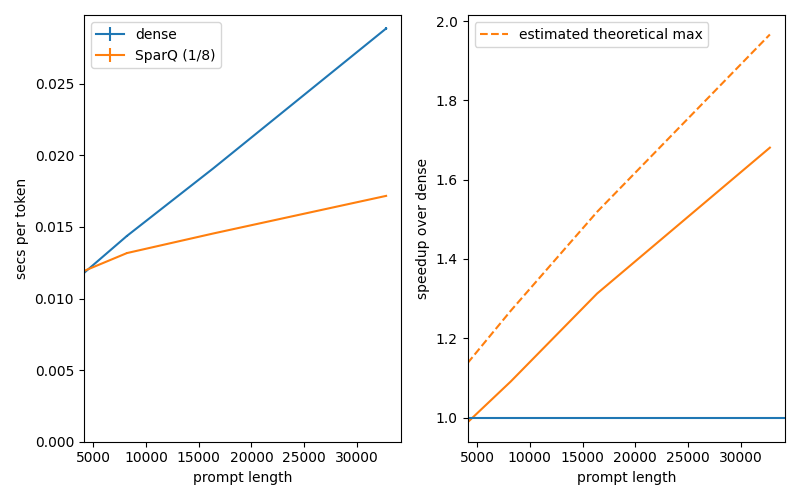

# gpt-fast with SparQ Attention
We extend [gpt-fast](https://github.com/pytorch-labs/gpt-fast) to support SparQ attention, a bandwidth-efficient attention algorithm that speeds up generation for existing LLMs with no fine tuning.
For details of SparQ, see [the paper](https://arxiv.org/pdf/2312.04985).

The `main` branch tracks the gpt-fast repo. The `with-sparq` branch contains our modifications. You can [compare "main" and "with-sparq"](https://github.com/graphcore-research/sparq-gpt-fast/compare/main...with-sparq) to see what we added.

You might also be interested in [sparq-llama.cpp](https://github.com/graphcore-research/sparq-llama.cpp), our implementation of SparQ in llama.cpp.

## Results
We obtain the following speedups on an H100 PCIe, using BF16 for the model parameters and KV cache, and compressing the memory transfers 8x with SparQ:

"estimated theoretical max" shows an estimate of the best-cast speedup that could be achieved by SparQ if the attention operation was purely memory-bound, and all compute and communication was overlapped. See `theoretical_speedups.py` for how this is calculated.

## How to reproduce the results
1. Install Python >=3.10
2. Install the requirements: `pip install -r requirements.txt`
3. Run `huggingface-cli login` or set the `HF_TOKEN` environment variable. The associated account must have access to `meta-llama/Llama-2-7b-chat-hf`
3. Download Llama 2 7b from Hugging Face, and prepare it for gpt-fast: `./scripts/prepare.sh "meta-llama/Llama-2-7b-chat-hf"`
4. Updated `expected_gpu` in `run_speedup_benchmark.py` to the expected model of GPU (this avoid accidentally comparing results from different GPUs)
5. Run the benchmark: `python run_speedup_benchmark.py`

SparQ is implemented in PyTorch, not as a custom kernel.
However, we found that torch.compile() was able to generate a performant implementation.

## License
This repo is based off [gpt-fast](https://github.com/pytorch-labs/gpt-fast), which is released under the BSD 3 license.
We also release our modifications under the BSD 3 license.
See [LICENSE](LICENSE).

